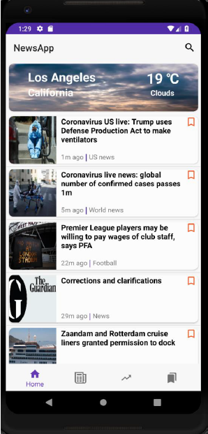
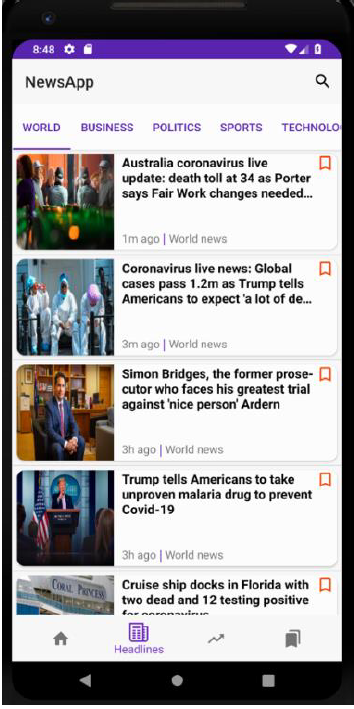
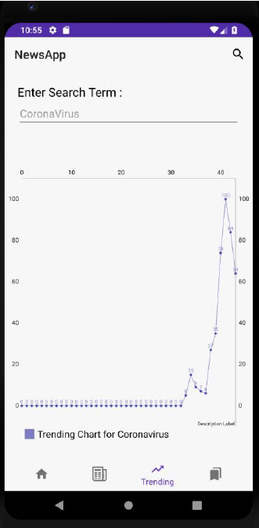
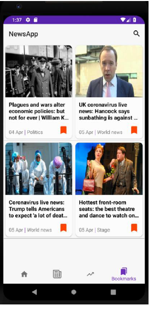
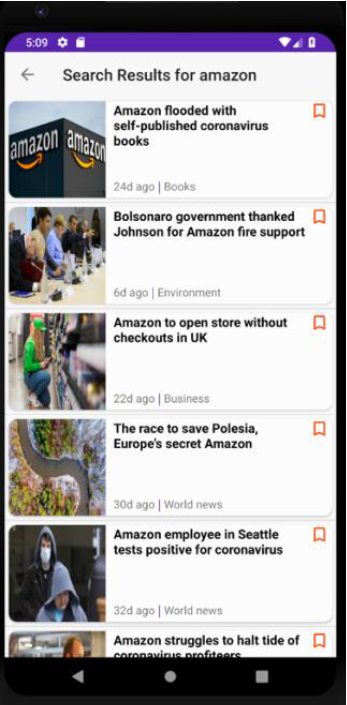

# Android-NewsApp

## Introduction

Android application, which allows users to search for latest news, look at detailed information about them, bookmark those news and post on Twitter about them.
## Features

* **Home Tab**:
When you open the app, there is a Toolbar at the top with the search icon and a Navigation
bar at the bottom. Both of these persists for all the 4 tabs.
As soon as you open the app, the weather summary card of the current location of the user
is displayed and below the weather card there is a list of 10 latest news.

The current location is to be fetched from the emulator itself, which will be used to call the
Openweathermap API to get the weather data.
The list of news is to be fetched from the Guardians API.
Guardians API data is being fetched from NodeJS backend hosted at GCP.

Every news card is clickable to go to detailed news activity.
Every news card has a long click feature which will open a Dialog.
On long click on a news card, a dialog will pop up with the image, title and the option to
Bookmark and share it on Twitter as shown

* **Headlines Tab**:
In this tab there are multiple fragments of different categories.
Every news card is clickable to go to detailed news activity.
Every news card has a long click feature which will open a Dialog.
On long click on a news card, a dialog will pop up with the image, title and the option to
Bookmark and share it on Twitter.

* **Trending Tab**:
This tab uses MPAndroidChart 3rd party library. You must add this as a dependency.
Data is fetched from NodeJS backend hosted at GCP.

* **Adding to Bookmark**:
The user can add a news article to bookmark from the Home Tab, Headlines Tab and also
when the user searches from a particular keyword. The news can be also bookmarked from
the dialog on long press.
The user can remove a news article from the Home Tab, Headlines Tab, Search Activity and
also from the Bookmark tab. The news can be also removed from bookmark using the dialog
on long press.
This functionality is implemented using SharedPreferences.

* **Search Functionality**:
On top right side, there will be a search button which opens a textbox where the user
can enter keyword to search for news. For the autosuggest API, call the Microsoft Bing Autosuggest API directly from the Android App 

## Screenshots

    
